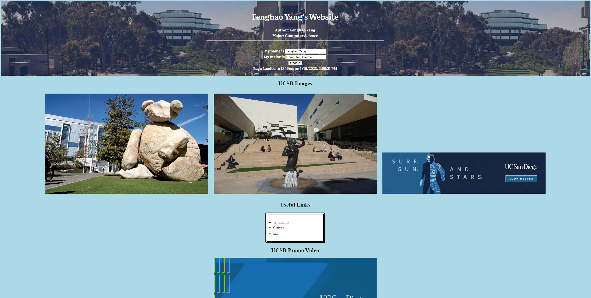
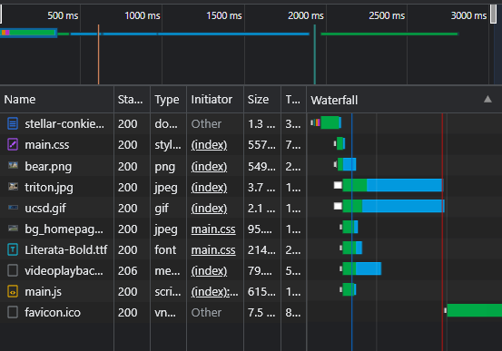
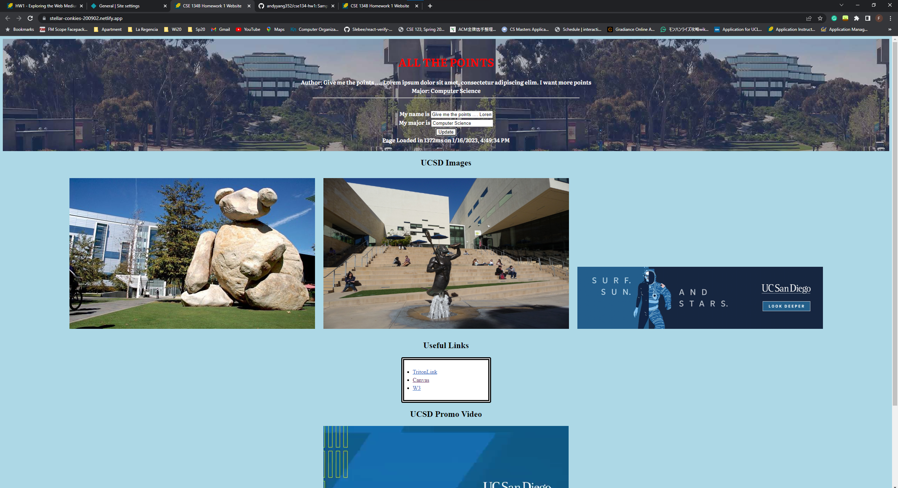

# CSE134B-SS20-HW1
# Name: Fenghao Yang
# PID: A15923702

# Part 1
### Question 1: 
- Site Url: https://github.com/andyyang352/cse134-hw1.git
- 

## Question 2. Chrome DevTools - Network:
1. \# of Requests by Content Type: 9 Types
2. Total # of Requests: 10 Requests
3. Total Bytes Sent: 6.8MB/6800000B sent 
4. Waterfall of Requests Screen Capture: 

## Question 3. Client-Side Inherently Insecure Demo

# Part 2
1. Navigating through ESPN site was not very easy. Since the website contains too many information, it was hard for me to use the screen reader to locate the Top Headline section. After looking at the website structure, the page was divided into three main column where the Top Headline is located in the last column. In order to visit the last column using screen reader, I have to go through tons of news that is located in the middle section. 
2. Navigating through webaim.org site was much easier compared to the ESPN site since the homepage contains more consise information. It was pretty easy to locate the Web Accessibility Training page using the screen reader extension. The overall experience of using screen reader to navigate the webaim.org site was decent. 