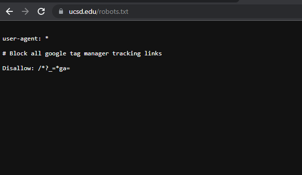
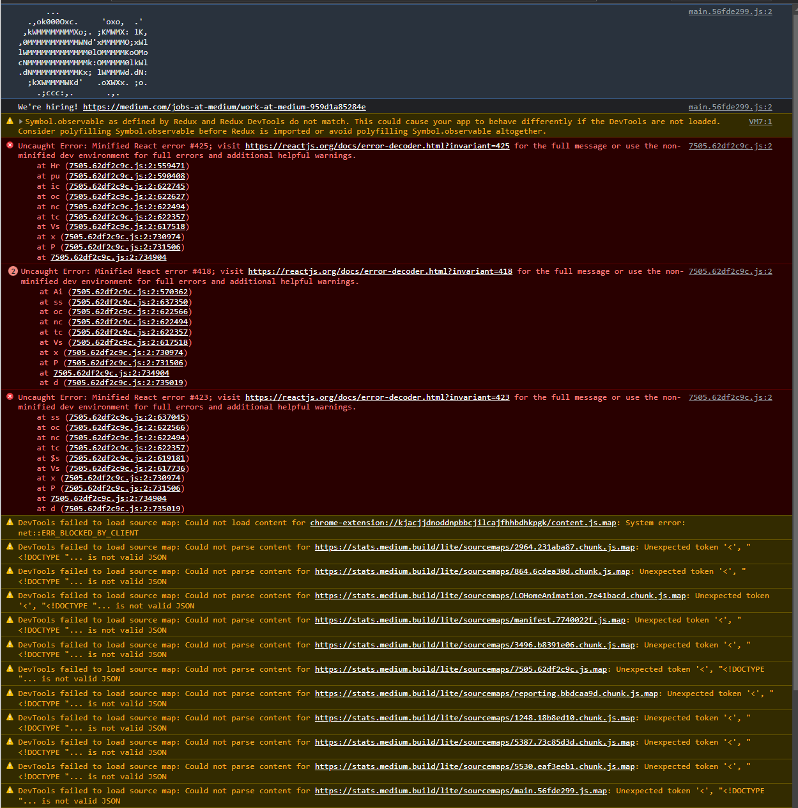
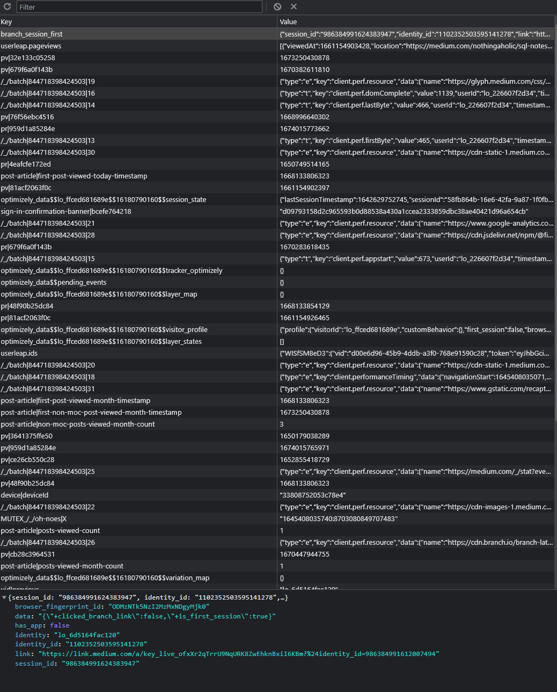
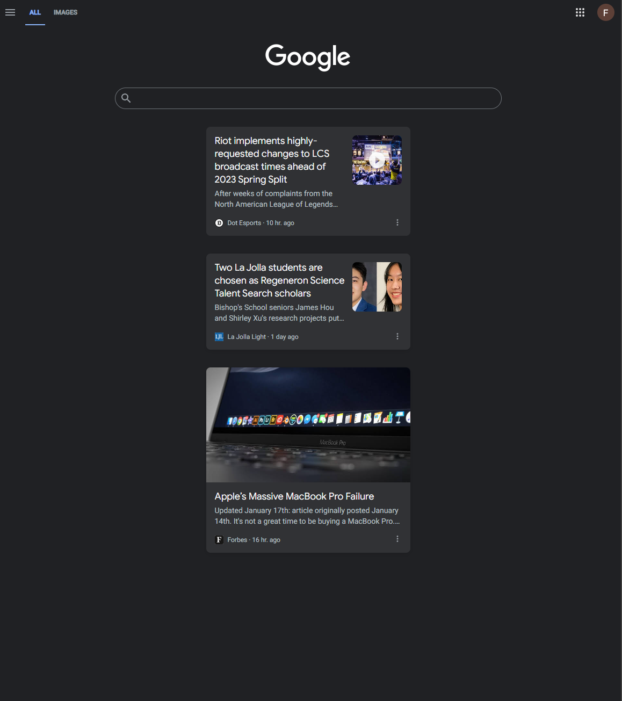
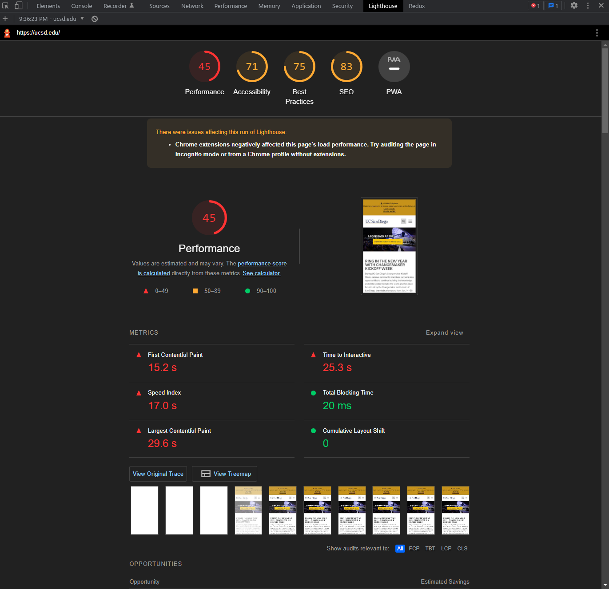
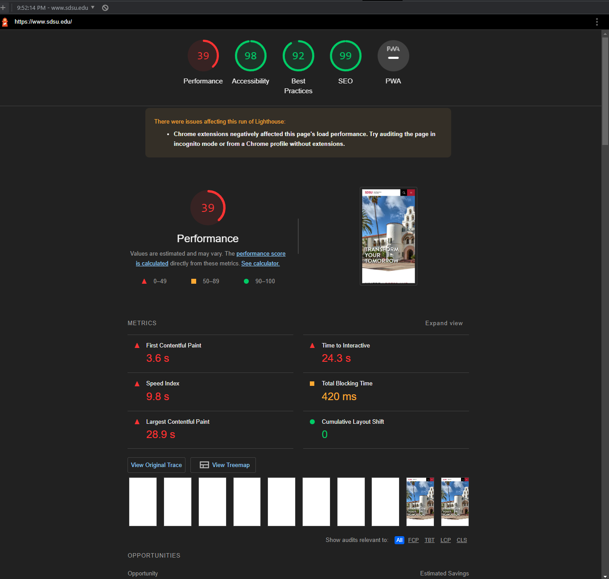

# CSE134B-SS20-HW1
# Name: Fenghao Yang
# PID: A15923702

# Part 1
### Question 1: 
- Site Url: https://github.com/andyyang352/cse134-hw1.git
- 

## Question 2. Chrome DevTools - Network:
1. \# of Requests by Content Type: 9 Types
2. Total # of Requests: 10 Requests
3. Total Bytes Sent: 6.8MB/6800000B sent 
4. Waterfall of Requests Screen Capture: 

## Question 3. Client-Side Inherently Insecure Demo

# Part 2
1. Navigating through ESPN site was not very easy. Since the website contains too many information, it was hard for me to use the screen reader to locate the Top Headline section. After looking at the website structure, the page was divided into three main column where the Top Headline is located in the last column. In order to visit the last column using screen reader, I have to go through tons of news that is located in the middle section. 
2. Navigating through webaim.org site was much easier compared to the ESPN site since the homepage contains more consise information. It was pretty easy to locate the Web Accessibility Training page using the screen reader extension. The overall experience of using screen reader to navigate the webaim.org site was decent. 

# Part 3
## Question 1. HTTP Response Headers
1. UCSD HTTP headers
    
2. UCI HTTP headers
    
3. HTTP headers of uci.edu contains way more information compare to the headers of ucsd.edu. More headers information means more vulnerable to various network attacks. 

## Question 2. JavaScript Off
1. UCSD visual changes 
    
2. There are some minor changes after JavaScript was disabled. Some of the animation, such as slider function, was disabled after javascript was disabled. Another big change was the covid updates on top of the page was gone. However, the overall strucutre of the website remains the same and there are little to no effects on how people view the whole website. 
3. UCLA visual changes
    
    
4. A lot of the section, such as news and feature, events, and UCLA right now, on UCLA website is created based on the JavaScript, so after disabling javascript function, these sections disappears from the website. 

## Question 3. Custom vs. Default 404 Pages
1. It does have a custom 404 page
    
2. https://www.csuci.edu/123456789
3. It does not have a custom 404 page
    
4. https://jpcatholic.edu/123456789
5. It will keep the user in our site when the users mistype their urls. If we do not have a custom 404 page, the user will leave the site enter other sites. In addition, a well-designed custom 404 page will provide better user experience as it can tell the users what went wrong and redirect them back to the corrent path. 

## Question 4. Search Engines - robots.txt
1. UCSD has robots.txt file
    
2. jpcatholic.edu does not have robots.txt file
3. This line of code in robots.txt of ucsd.edu is intended to block all google tag manger trackling links but it cannot block google tag manager from tacking the vistors. Also, with some few lines of restriction in robots.txt, the structure of the site may be vulnerable to some attacks. In addition, this specific line of code may affects the ranking in search engines.

## Question 5. Search Engines - Google Hacking
1. Google hacking is a process of using advanced search operators and queries to find vulnerable or sensitive information such as login and databases with google searches. 
2. Google bots is a web crawler that Google search uses to do searching, indexing and ranking. It visits the websites and follow the links in the website to help in search function. Google bots itself is not troubling, but hacker can active google bots to do website attack, such as acquiring sensitive information, with the help of google hacking. 
3. As a web developer, the main thing we need to worried about is crawlability of Google bots. We can use robots.txt file to limit the pages that a web crawler, such as google bots, can visit. This can prevents google crawler from visiting vulnerable and sensitive information from your website. Indexability is another thing we can improve as a web developer. We can modify the links and path of our website to ensure that web crawler can easily access the main information of the website. 
4. Robots.txt file can limit the performance of google bots and thus protect the website from google hacking. We can write the path of any sensitive information in the robots.txt so that the web crawler is unable to access. In this way, since the google bots are unable to vistie the path, the attackers are unable to access thsoe sensitive information through Google Hacking. 

## Question 6. Search Engines - Google Results Reality Check
1. About 2,060,000 results in 0.52 seconds
2. I am unable to find the 500-510th because google omitted repeated results and only shows around 100 results
3. Google omitted the repeated results so we can only see around 100 useful results. This would help google search to return the results faster and thus increase user experiences. 

## Question 7. Chrome DevTools - JavaScript Console and Local Storage
1. Medium put hiring information in console
    
2. Only web developer will use Dev Tools to check the console. Therefore, only web developer can find the medium hiring information for software developer, which is the intended purpose for medium. 
3. Local Storage from medium.com is used to store the session data of current session. 
    

## Question 8. Chrome DevTools - Console and Source
1. The variable name is datasetCount and the value is 3114
2. The message is printed through "console.log()" function in js. The developer used this function to debug in developing process and they may forget to delete this line after set the website up on server. 
3. If the developer print more sensitive information on the console while debugging and forget to delete the line after publishing, some attackers can easily acquire the information from console and do various website attacks with it. 

## Question 9. Chrome DevTools - User Agent Header
1. For iPhone agent, Google add an extra trending section to show the trending news under the google search bar
2. 
    As shown above, there is a trending section below the google search bar but there are no trending news in the web version. 

## Question 10. Chrome DevTools - Extension Header 
- `X-Content-Type-Options: nosniff` This value prevents browser from trying to "sniff" the content type of a file
- `x-download-options: noopen` This value tells the browser to open downloaded files in the associated application, rather than executing them within the browser
- `x-frame-options: DENY` This value tells the browser that the website should not be displayed in a frame or iframe, regardless of the source of the frame or iframe
- `x-permitted-cross-domain-policies: none` This value tells the browser that the website should not be loaded by other websites via a cross-domain policy file, such as a crossdomain.xml or clientaccesspolicy.xml
- `x-xss-protection: 0` This value tells the browser to disable its built-in XSS protection

## Question 11. Chrome DevTools - Performance Test
1. 
2. First suggestion is to reduce unused CSS. Many of the CSS in the file was not used, so reduce those CSS would decrease the byte consume by the network activity. The second suggestion is to eliminate render-blocking resources. Currently the structure of JS/CSS is reducing the loading speed of the website. Delivering critical JS/CSS inline and deferring all non-critical JS/styles would help. 
3. 
    The performance score of sdsu.edu is 39 which is lower than ucsd.edu's 45
4. According to the lighthouse performance score, SDSU has more performance work to do. 

## Question 12. Browsers Versions
1. Status URLs:
    - Google Platform Status: https://chromestatus.com/roadmap
    - Firefox platform page: https://developer.mozilla.org/en-US/docs/Mozilla/Firefox/Platform
    - Edge Platform Status: https://developer.microsoft.com/en-us/microsoft-edge/status/
    - Safari (aka Webkit) Feature Status page: https://webkit.org/status/
2. Shadow DOM v1 was introduced in Chrome version 53
3. The technology was released on Aug 30, 2016
4. Chrome would be 15 years old on September 2nd, 2023

## Question 13. Testing Different or Older Browsers
1. The old version cannot support ucsf.edu
    
2. When discussing what browers are supported by a site, we need to specify the specific minimum requirement/version of the browsers that is able to support the normal functionality of a website. In addition, we also need to identify the unsupported browsers. 

## Question 14. UCSF.edu 
1. This value tells the browser to execute files in the manner that they were declared in the headers, regardless of the file's actual content.
2. Cloudflare is a company that provides a variety of services for improving website performance, security and reliability. These services include a content delivery network (CDN), distributed DNS, and a web application firewall (WAF). Cloudflare can improve site performance, security, and reliability. It is particularly useful for sites that have a global audience and need to deliver content quickly and securely to a wide variety of locations.

## Question 15. Cookies
1. ucsd.edu have 82 Cookies
2. 6 different domains
3. ucsd.edu Domains:
    - .google.com
    - .youtube.com
    - www.google.com
    - .linkedin.com
    - .ads.linkedin.com
    - .ucsd.edu
4. sdsu.edu have 46 Cookies
5. 9 Different domains
6. sdsu.edu Domains: 
    - .google.com
    - .simpli.fi
    - .doubleclick.net
    - 66356343.global.siteimproveanalytics.io
    - ou.resource.sdsu.edu
    - www.google.com
    - .facebook.com
    - .sdsu.edu
    - www.sdsu.edu