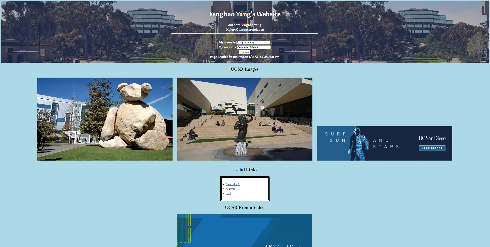
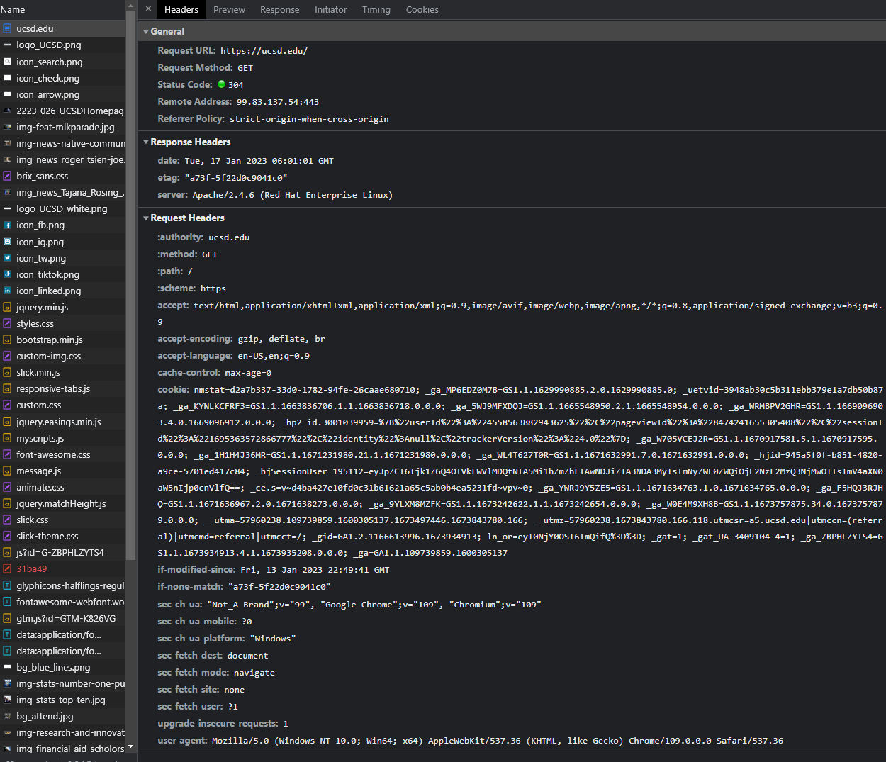
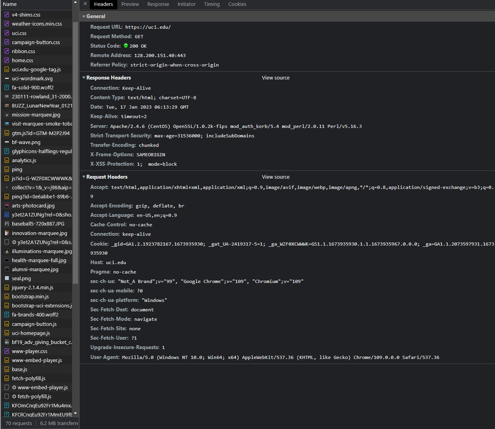
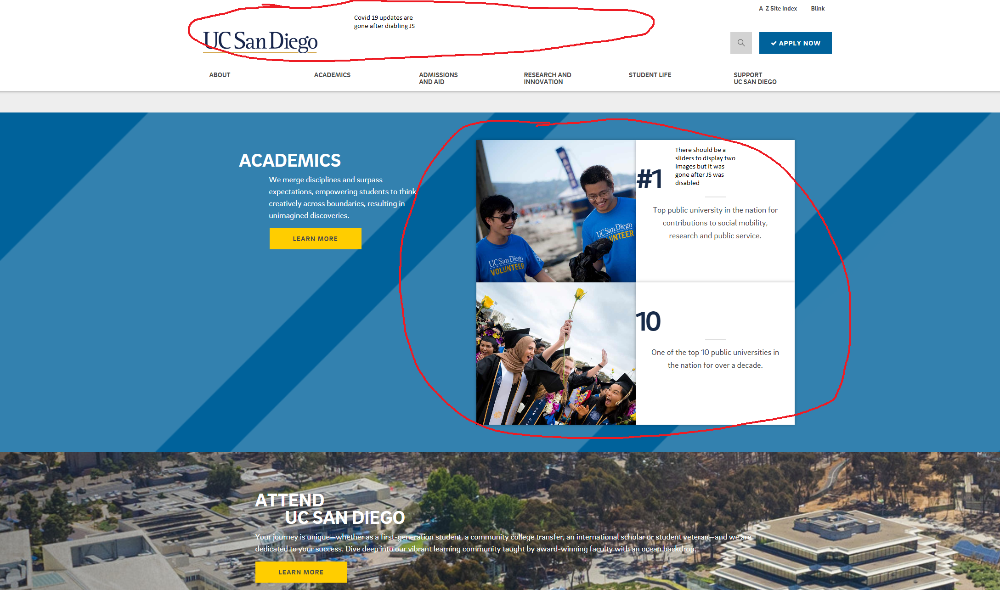
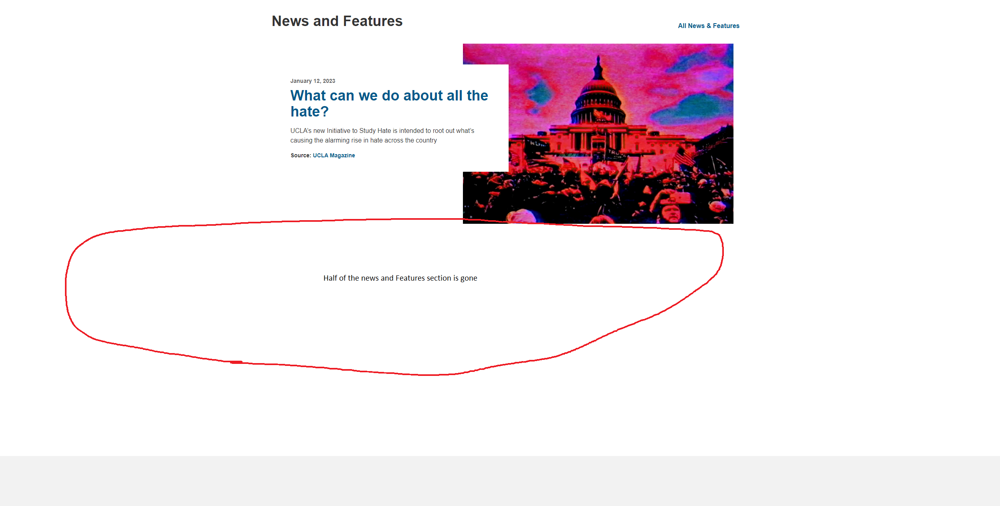
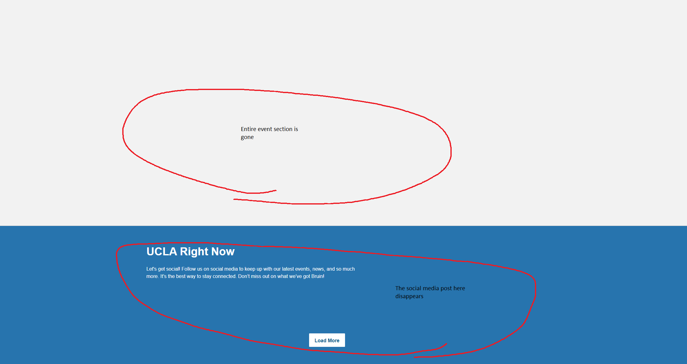
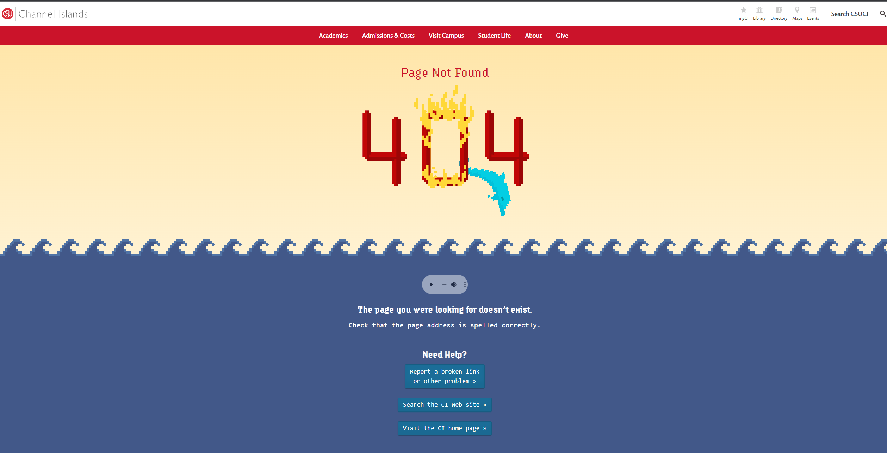
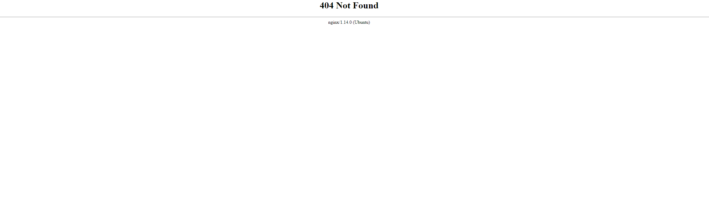

# CSE134B-SS20-HW1
# Name: Fenghao Yang
# PID: A15923702

# Part 1
### Question 1: 
- Site Url: https://github.com/andyyang352/cse134-hw1.git
- 

## Question 2. Chrome DevTools - Network:
1. \# of Requests by Content Type: 9 Types
2. Total # of Requests: 10 Requests
3. Total Bytes Sent: 6.8MB/6800000B sent 
4. Waterfall of Requests Screen Capture: 

## Question 3. Client-Side Inherently Insecure Demo

# Part 2
1. Navigating through ESPN site was not very easy. Since the website contains too many information, it was hard for me to use the screen reader to locate the Top Headline section. After looking at the website structure, the page was divided into three main column where the Top Headline is located in the last column. In order to visit the last column using screen reader, I have to go through tons of news that is located in the middle section. 
2. Navigating through webaim.org site was much easier compared to the ESPN site since the homepage contains more consise information. It was pretty easy to locate the Web Accessibility Training page using the screen reader extension. The overall experience of using screen reader to navigate the webaim.org site was decent. 

# Part 3
## Question 1. HTTP Response Headers
1. UCSD HTTP headers
    
2. UCI HTTP headers
    
3. HTTP headers of uci.edu contains way more information compare to the headers of ucsd.edu. More headers information means more vulnerable to various network attacks. 

## Question 2. JavaScript Off
1. UCSD visual changes 
    
2. There are some minor changes after JavaScript was disabled. Some of the animation, such as slider function, was disabled after javascript was disabled. Another big change was the covid updates on top of the page was gone. However, the overall strucutre of the website remains the same and there are little to no effects on how people view the whole website. 
3. UCLA visual changes
    
    
4. A lot of the section, such as news and feature, events, and UCLA right now, on UCLA website is created based on the JavaScript, so after disabling javascript function, these sections disappears from the website. 

## Question 3. Custom vs. Default 404 Pages
1. It does have a custom 404 page
    
2. https://www.csuci.edu/123456789
3. It does not have a custom 404 page
    
4. https://jpcatholic.edu/123456789
5. It will keep the user in our site when the users mistype their urls. If we do not have a custom 404 page, the user will leave the site enter other sites. In addition, a well-designed custom 404 page will provide better user experience as it can tell the users what went wrong and redirect them back to the corrent path. 

